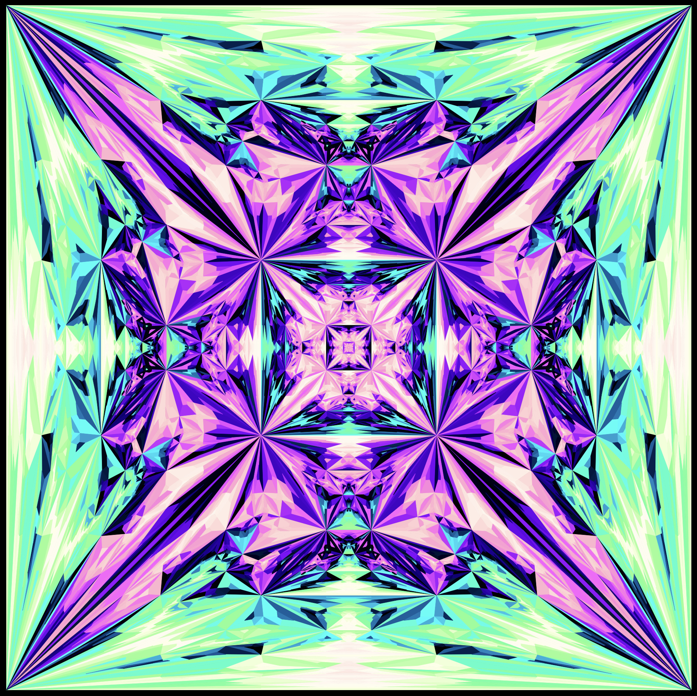

# subtiles

Extensible framework for creating recursive geometry and subdivision tilings. **Pull Requests Welcome!!**

[https://oscarsaharoy.github.io/subtiles](https://oscarsaharoy.github.io/subtiles)

## about

<p> subtiles is a web app that allows you to create subdivision tilings.
	It takes in SVG files with a certain format which defines the subdivision.
	You can supply your own files with the open button 
	or use one of the presets with the preset button.
	The web app then parses the file and uses the information to calculate the subdivided geometry -
	you can use the plus and minus buttons to increase or decrease the displayed subdivision level.
	There are also different mapping functions which can be selected with the mapping button,
	but these have more effect on some tilings than on others.
	Different colour palettes can be selected with the palette button and 
	the theme can be toggled with the dark / light mode button.
	The thickness button allows you to set the line thickness 
	and the download button downloads the subdivision tiling as an SVG. </p>
<p> Tip: press L to view the program logs! </p>


<p class="caption"> A graphic created by recursively dividing quadrilaterals into 5 more quadrilaterals. </p>

## SVG input file format
<p> Input files can be created with an svg editor like inkscape. 
	Each path in the file represents a tile and SVG groups are used to define the relationships between them. <br><br>
	Each tile type that you want to define a subdivision rule for should be in its own group. The only other thing in the group should be a group of tiles to subdivide it into.
	Each iteration, tiles that match the outer tile will be subdivided into those in the inner group. <br><br>
	Matching of tiles to subdivision rules is done by matching the number of vertices of a tile to the number of vertices in the outer tile of the subdivision rule.
	If no subdivision rule matches, the tile is not subdivided. </p>

<pre>
&lt;g&gt; outer subdivision rule group
├── &lt;path&gt; parent tile to be subdivided
└── &lt;g&gt; inner subdivision result group
    ├── &lt;path&gt; top right child tile
    ├── &lt;path&gt; top left child tile
    ├── &lt;path&gt; bottom right child tile
    ├── &lt;path&gt; bottom left child tile
    └── &lt;path&gt; center child tile
</pre>
	
<p> You can take a look at the <a href="presets/square.svg">square</a> and <a href="presets/pentagon.svg">pentagon</a> presets for examples.</p>


<p class="caption"> This is another example with two tile types. </p>

## Running Locally
This is a vanilla html/css/js web app so to run it locally you just need to clone the repo and start a webserver from the root directory.
The `./runlocal.sh` script can also be used and is just a shortcut for `python3 -m http.server`.

```bash
git clone git@github.com:OscarSaharoy/subtiles.git
cd subtiles
./runlocal.sh
```
You can then access the site from `http://localhost:8000`.


<p class="caption"> This tiling uses the "radial" palette, applied after a few subdivisions with a different palette. </p>


<p class="caption"> This image was made with the conformal mapping function and the square preset. </p>

## More Info
<p> If you would like to know more about subdivision tilings please take a look at the 
	<a href="https://en.wikipedia.org/wiki/Finite_subdivision_rule" target="_black">wikipedia page</a> 
	- the references and external links on this page are also very helpful. </p>


<p class="caption"> Custom colouring functions can be defined in the `js/palette.js` file to get results like this. <br>
	Make sure to add them to the palette menu in `index.html`! </p>
